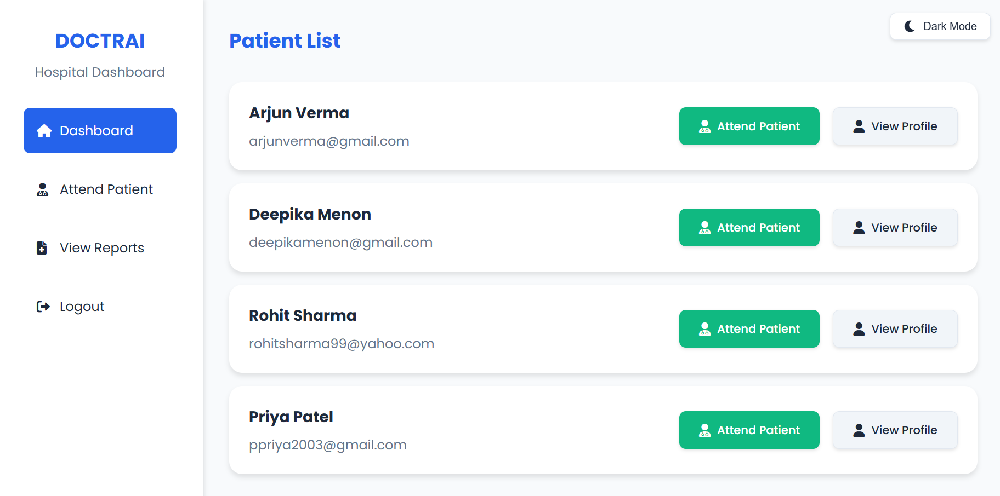
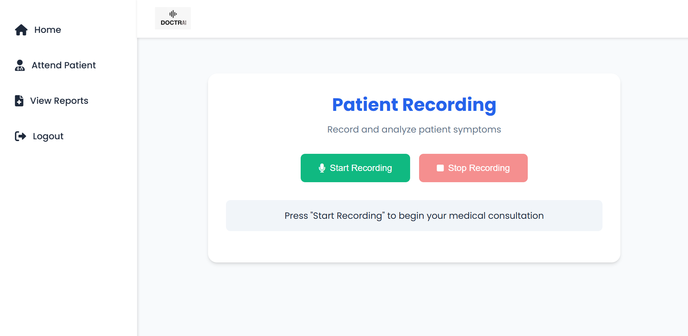
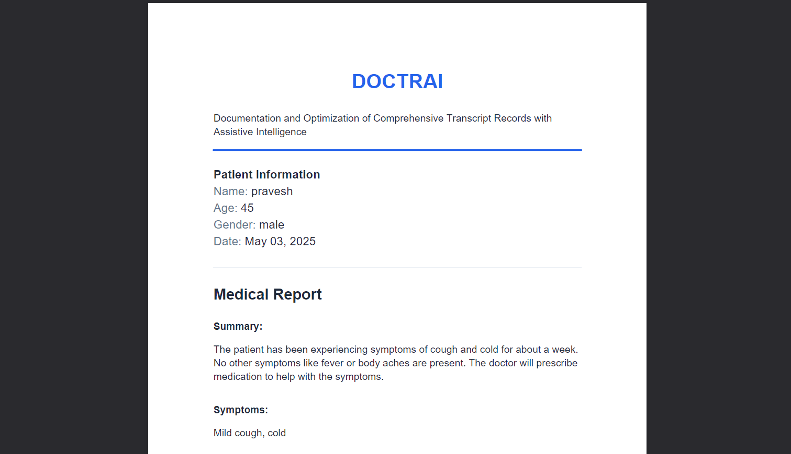

# DOCTRAI - Medical Documentation Assistant

DOCTRAI (Documentation and Optimization of Comprehensive Transcript Records with Assistive Intelligence) is an intelligent medical documentation system that helps healthcare professionals transcribe, analyze, and generate medical reports from doctor-patient conversations.

## Features

- 🎙️ **Voice Recording**: Record doctor-patient conversations directly through the web interface
- 🤖 **AI-Powered Transcription**: Automatic transcription of medical conversations using OpenAI's Whisper model
- 🔍 **Symptom Analysis**: Intelligent extraction and mapping of symptoms from conversations
- 📝 **Automated Report Generation**: Generate professional medical reports in PDF format
- 👥 **Multi-User System**: Separate interfaces for hospitals and patients
- 🔒 **Secure Access**: Role-based access control for medical records
- 📊 **Report Management**: Easy access to historical medical reports

## Screenshots

### Hospital Dashboard

*Main interface for hospitals to manage patients and view reports*

### Recording Interface

*Voice recording interface for doctor-patient conversations*

### Generated Report

*Example of an automatically generated medical report*

## Tech Stack

- **Backend**: Python Flask
- **Database**: MongoDB
- **AI/ML**: 
  - OpenAI Whisper for speech-to-text
  - OpenAI GPT for conversation analysis
  - OpenAI GPT-4 for medical report generation
- **Frontend**: HTML, CSS
- **PDF Generation**: ReportLab

## Prerequisites

- Python 3.8+
- MongoDB
- OpenAI API key
- Required Python packages (see Installation section)

## Installation

1. Clone the repository:
```bash
git clone https://github.com/yourusername/doctrai.git
cd doctrai
```

2. Create and activate a virtual environment:
```bash
python -m venv venv
source venv/bin/activate  # On Windows: venv\Scripts\activate
```

3. Install required packages:
```bash
pip install -r requirements.txt
```

4. Set up environment variables:
Create a `.env` file in the project root with the following variables:
```
FLASK_SECRET_KEY=your-secret-key
MONGODB_URI=mongodb://localhost:27017/
OPENAI_API_KEY=your-openai-api-key
```

5. Start MongoDB service on your system

6. Run the application:
```bash
python app.py
```

## Project Structure

```
doctrai/
├── app.py              # Main application file
├── requirements.txt    # Python dependencies
├── .env               # Environment variables (not in git)
├── .env.example       # Example environment variables
├── templates/         # HTML templates
├── static/           # Static files (CSS, JS, images)
└── uploads/          # Temporary storage for audio files
```

## Usage

1. **Hospital Registration/Login**
   - Register as a hospital
   - Log in to access the hospital dashboard
   - Manage patients and view reports

2. **Patient Registration/Login**
   - Register as a patient
   - Log in to access personal medical records
   - View and download medical reports

3. **Recording Session**
   - Start a new recording session
   - Record doctor-patient conversation
   - System automatically processes the audio

4. **Report Generation**
   - System generates a comprehensive medical report
   - Report includes symptoms, diagnosis, and prescriptions
   - Download report in PDF format

## License

This project is licensed under the MIT License - see the [LICENSE](LICENSE) file for details.